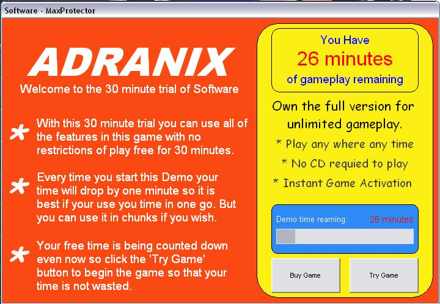



## MaxProtector Registration System

### Description

With this code users or your software can use it for 30 mins free then they have to buy a code from you at your price to unlock the software. If the user gets the registration code wrong 5 times they must get a PUK code off of you and unlock the software. if they stop playing half way though there time will be saved and resumend when they open it again. It has lots of features and took me a long time to make also i am only 14 and havent been doing VB for long so please please please VOTE! Thanks
 
### More Info
 

             |
---                |---
**Submitted On**   |2004-09-20 21:29:24
**By**             |[Adam Ranshaw](https://github.com/Planet-Source-Code/PSCIndex/blob/master/ByAuthor/adam-ranshaw.md)
**Level**          |Intermediate
**User Rating**    |4.3 (34 globes from 8 users)
**Compatibility**  |VB 5\.0, VB 6\.0
**Category**       |[Encryption](https://github.com/Planet-Source-Code/PSCIndex/blob/master/ByCategory/encryption__1-48.md)
**World**          |[Visual Basic](https://github.com/Planet-Source-Code/PSCIndex/blob/master/ByWorld/visual-basic.md)
**Archive File**   |[MaxProtect1797319252004\.zip](https://github.com/Planet-Source-Code/adam-ranshaw-maxprotector-registration-system__1-56338/archive/master.zip)

